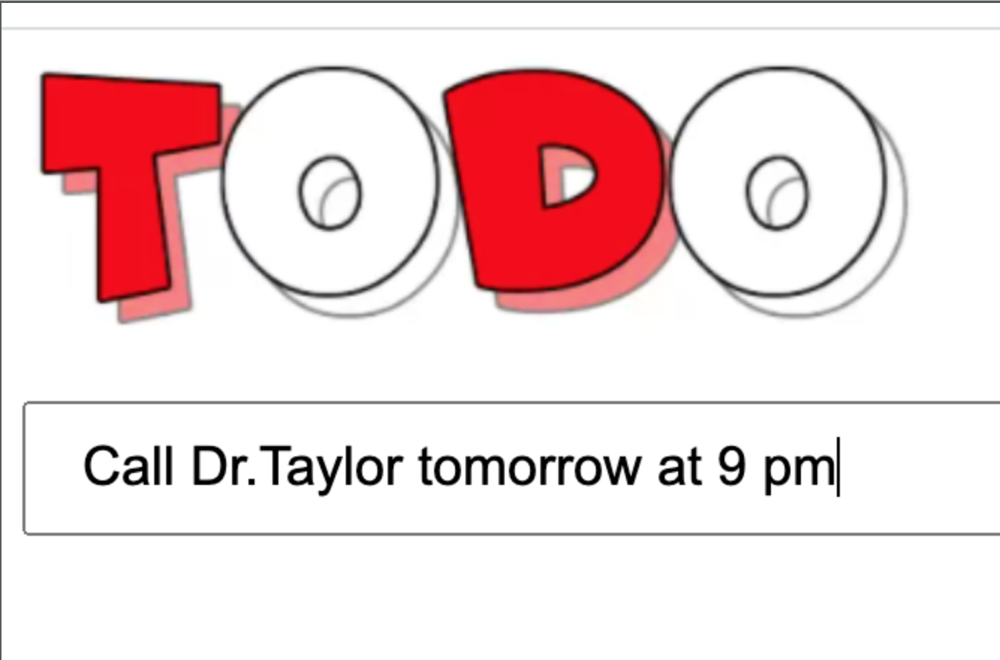
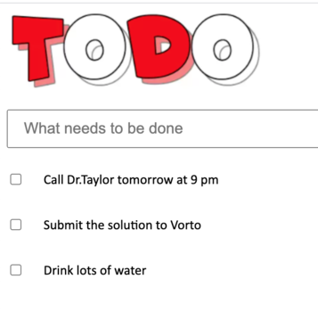
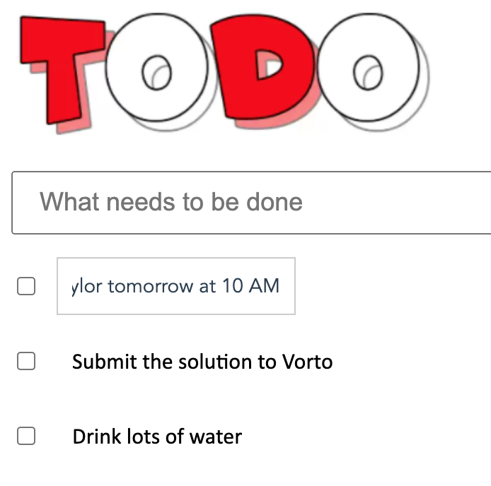
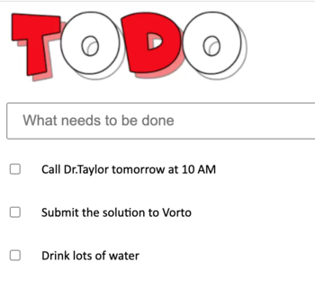
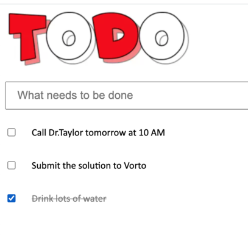
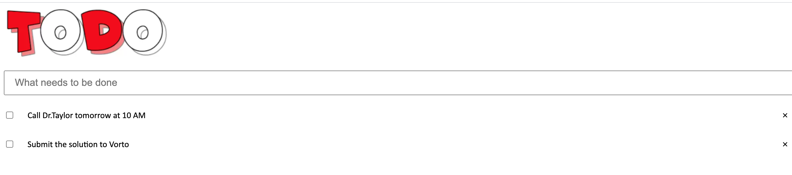

# SheshankkodamWebTodo

This project was generated with [Angular CLI](https://github.com/angular/angular-cli) version 10.0.0.

## Development server
* Navigate to [https://sheshankkodam-web-todo.herokuapp.com/](https://sheshankkodam-web-todo.herokuapp.com/)
* Add a todo by writing in the text box and hot enter 

  
  
  
  
* Update a todo task by double clicking on the task  
  
  
  
* Mark the task as complete by clicking on the checkbox and vice versa
  
  
* Delete the task by clicking on the cross icon 
  

